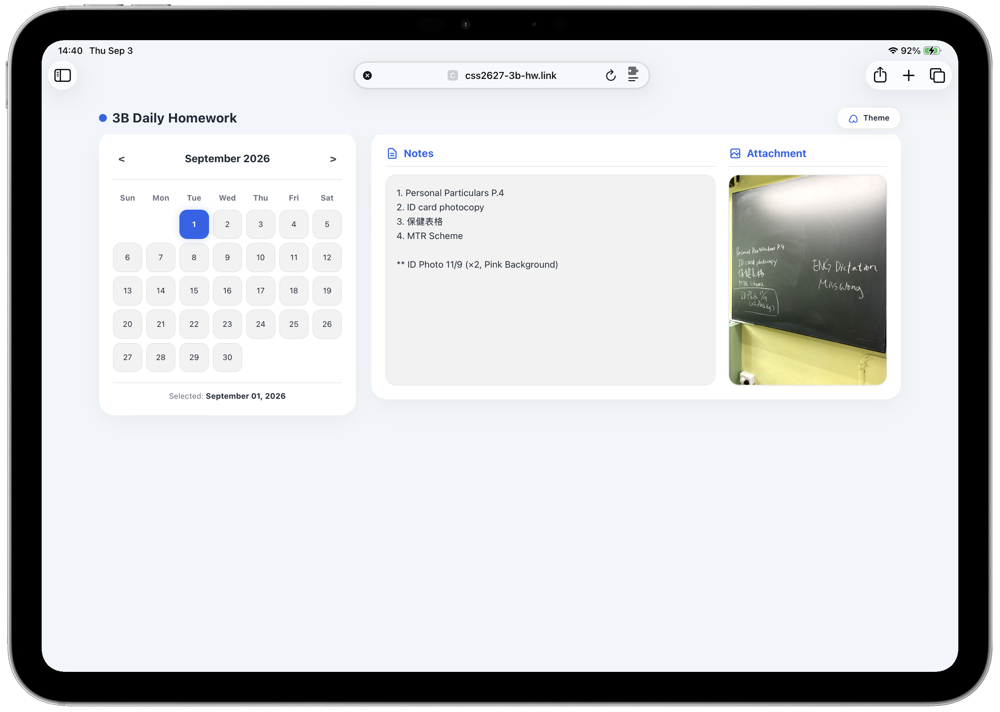
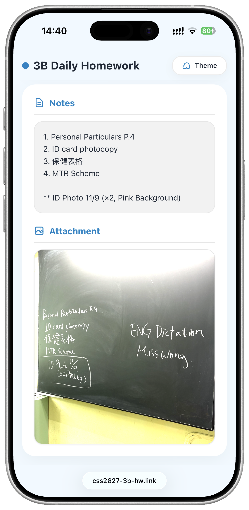

<div align="left">

  <!-- 專案標題與主視覺 -->
  <h1>CSS 26-27 3B Daily Homework</h1>

  <!-- 技術徽章 -->
  <p>
    
    
    
    
  </p>

  <br>

  <!-- 四張截圖排版：左邊 iPad 上下兩張，右邊 iPhone 上下兩張 -->
  <table border="0">
    <tr>
      <td align="center" width="50%">
        <br>
        <sub><b> iPad Preview (Light Mode) </b></sub>
      </td>
      <td align="center" width="50%">
        <br>
        <sub><b> iPhone Preview (Light Mode) </b></sub>
      </td>
    </tr>
    <tr>
      <td align="center">
        <br>
        <sub><b>📱 iPad 視圖（下半部）</b></sub>
      </td>
      <td align="center">
        <br>
        <sub><b>📱 iPhone 視圖（下半部）</b></sub>
      </td>
    </tr>
  </table>

  <br>

  <!-- 線上預覽按鈕 (請把網址換成你的 GitHub Pages 網址) -->
  <a href="https://www.css2627-3b-hw.link" target="_blank">
    
  </a>

</div>

---

## 📖 專案介紹
這是一個專為展示個人作品、技能與經歷所打造的響應式網站。介面設計注重使用者體驗（UX），無論在平板（iPad）或智慧型手機（iPhone）等不同尺寸的螢幕上都能完美呈現。

---

## ✨ 核心特色
* **📱 響應式網頁設計 (RWD)**：完美適應各種尺寸的行動裝置。
* **🎨 現代化視覺風格**：採用簡約大方的排版、舒適的色彩搭配與滑順的過場互動。
* **⚡ 輕量與高效能**：載入速度極快，操作體驗流暢。
* **🛠️ 模組化結構**：程式碼結構清晰，方便日後擴充與維護。

---

## 🛠️ 使用技術
| 技術分類 | 名稱 / 工具 | 用途說明 |
| :--- | :--- | :--- |
| **前端結構** | HTML5語意化標籤 | 構築網頁骨架與內容 |
| **樣式排版** | CSS3 (Flexbox / Grid) | 視覺美化、排版與響應式切版 |
| **互動效果** | JavaScript (ES6+) | 網頁動態特效、選單開關等 |
| **版本控制** | Git / GitHub Pages | 程式碼管理與專案線上部署 |

---

## 📂 專案資料夾架構
```text
📦 CSS_26-27_3B_HW_Photos
 ┣ 📂 images/          # 存放網站截圖與圖片
 ┃  ┣ 📜 ipad_top.png
 ┃  ┣ 📜 ipad_bottom.png
 ┃  ┣ 📜 iphone_top.png
 ┃  ┗ 📜 iphone_bottom.png
 ┣ 📜 index.html       # 網頁主頁面
 ┣ 📜 CNAME            # 自訂網域設定檔
 ┗ 📜 README.md        # 專案說明文件
